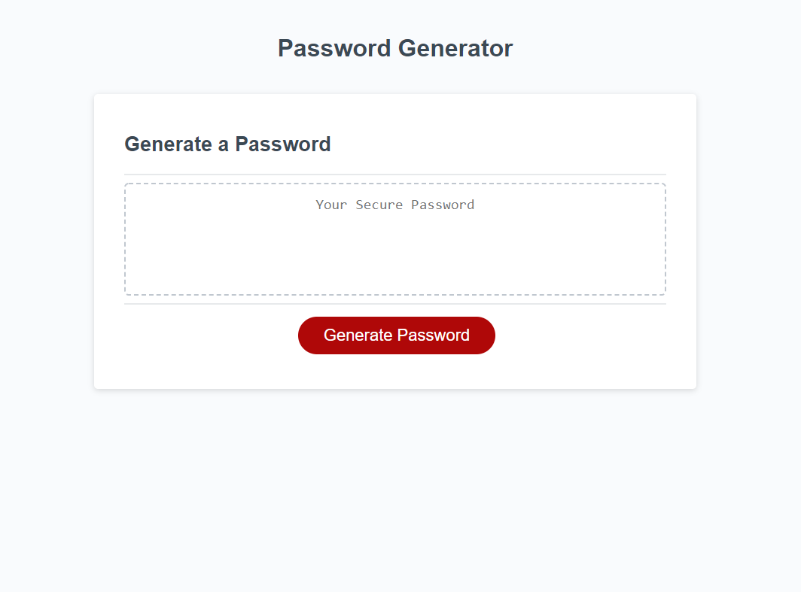

# password-generator

## Description

In this program I have created a password generator as an example of how to use JavaScript to create a simple program within a browser. This was a very rewarding experince as I had ablsolutely no idea how to even start when the homework was given out, and by the end had a working password generator.

## Usage

To use this paswword generator simply visit https://tjcourey.github.io/password-generator/

Here is a screenshot of the page on loading in my local browser
md 

## Credits

People who helped with code and sanity:

-Andrew Tirpok
-Zach Wahrer

## Features

Available options:
Upper case letters,
Lower case letters,
Symbols,
Numbers,
Between 8-128 characters

## How to Contribute

No contribution necessary but feedback is welcome and appreciated!
